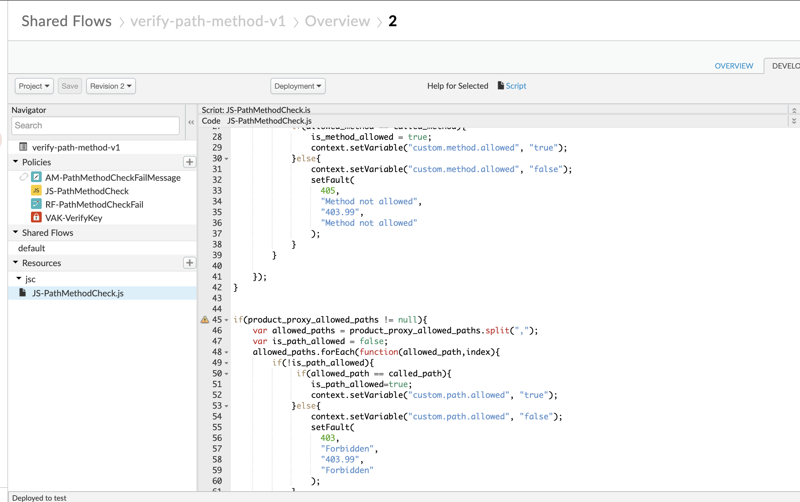

# Verify Path (suffix) or HTTP Verb (method) for API Product with Shared Flow for APIGEE Edge

This shared flow will help with checking allowed proxy suffix (path) and HTTP verb (method) that are allowed to be called based on setting done on API Product inside APIGEE Edge.

- - - -

## Basic Settings
Inside your API Product make sure to add the proxy for which you are trying to setup check for suffix and methods

- Add Custom attributes inside your API Product to configure allowed suffix and methods in a comma seperated values in below format
  - <API_PROXY_NAME>_AllowedMethods = GET,POST
  - <API_PROXY_NAME>_AllowedPaths = /path1,/path2/*

   - 

- - - -
## Usage
- Start with making an zip of folder ___sharedflowbundle___ inside ___verify-path-method-v1___ folder and then uploading it inside your Shared Flows of Apigee Edge, this will create a Shared Flow with name _verify-path-method-v1_

- You have two ways to utilize this sharedflow after you have deployed it to your environment
  - Using flowhook for your environment
  - Using a flow callout from your proxy at the start of your proxy flow

- This shared flow uses Verify API Key policy to capture custom attibutes of API Product.

- - - -
## Customization
## *IMPORTANT NOTE*
 - #### If you have a Verfiy API Key in your proxy than go to shared flow and remove the ___Verfiy API Key___ from shared flow, also this VAK will expect you apps to provide ___apikey___ inside header for API call

   `<APIKey ref="request.header.apikey"/>`

   You can customize this also if you want your apps to provide ___apikey___ in other location like query parameter.

   

- Currently shared flow throws a error if the path or the method is not allowed to be called for the product, The error looks like this.

  `{
      "code": "403.99",
      "message": "Forbidden",
      "info": "https://developers.example.com"
  }`

  This message can be customized by going to RaiseFault policy ___RF-PathMethodCheckFail___ of SharedFlow

  

- Error Message and Code
  - The JS policy ___JS-PathMethodCheck.js*___ that validates the path and method also sets error codes and message for the failed validation you can customize code and messages inside the JS policy

  - 

- - - -
## Sample
In source code I have published a sample proxy that you can deploy to test this shared flow

- Allowed path and method call sample

- Not Allowed path and method call sample

- - - -

## License

All solutions within this repository are provided under the
[Apache 2.0](https://www.apache.org/licenses/LICENSE-2.0) license.
Please see the [LICENSE](/LICENSE) file for more detailed terms and conditions.

- - - -
## Disclaimer

This repository and its contents are not an official Google product.